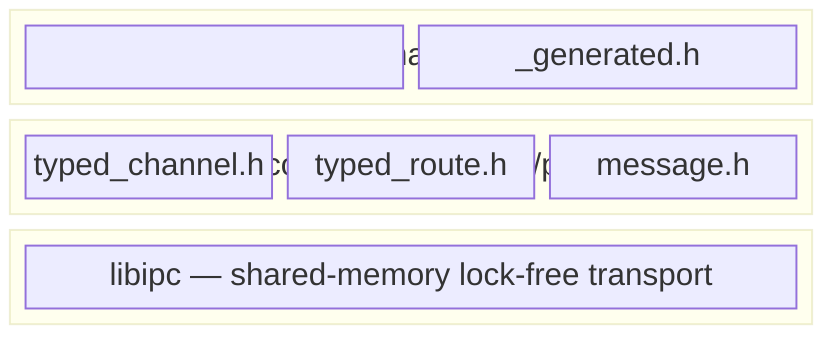

<!-- SPDX-License-Identifier: Apache-2.0 WITH LLVM-exception OR MIT -->
<!-- SPDX-FileCopyrightText: 2025-2026 natyamatsya and thoth-ipc contributors -->

# Typed Protocol Layer

The `thoth-ipc/proto/` headers provide a generic, header-only layer that combines
cpp-ipc's shared-memory transport with pluggable wire codecs for typed IPC
message passing between processes.

The default codec is [FlatBuffers](https://flatbuffers.dev/), with additional
scaffolding adapters available for Protocol Buffers and Cap'n Proto.

## Overview



## Headers

### `thoth-ipc/proto/message.h`

- **`thoth::proto::message<T>`** — wraps a received `thoth::buff_t`. Call `root()`
  for zero-copy access to the FlatBuffer root table. Supports `verify()` for
  untrusted data, `operator bool` for empty checks, and `operator->` for
  direct field access.

- **`thoth::proto::builder`** — wraps `flatbuffers::FlatBufferBuilder`. Use
  `fbb()` to build messages, then `finish(offset)` to finalize. Pass the
  builder directly to `send()`.

### `thoth-ipc/proto/typed_channel.h`

`thoth::proto::typed_channel<T>` — a typed wrapper around `thoth::channel`.

```cpp
#include "my_protocol_generated.h"
#include "thoth-ipc/proto/typed_channel.h"

// Sender
thoth::proto::typed_channel<MyMsg> ch("my_channel", thoth::sender);
thoth::proto::builder b;
auto off = CreateMyMsg(b.fbb(), /* fields */);
b.finish(off);
ch.send(b);

// Receiver
thoth::proto::typed_channel<MyMsg> ch("my_channel", thoth::receiver);
auto msg = ch.recv();       // blocking
auto msg = ch.try_recv();   // non-blocking
auto msg = ch.recv(1000);   // 1s timeout

if (msg) {
    auto *root = msg.root();   // zero-copy FlatBuffer access
    root->my_field();
}
```

### `thoth-ipc/proto/typed_route.h`

`thoth::proto::typed_route<T>` — same API as `typed_channel`, but wraps
`thoth::route` (single-writer, broadcast to N readers).

### `thoth-ipc/proto/codecs/*.h`

- **`flatbuffers_codec.h`** — default zero-copy codec used by
  `typed_channel<T>`/`typed_route<T>`.
- **`protobuf_codec.h`** — Phase B scaffolding for protobuf-like message types.
- **`capnp_codec.h`** — Phase C scaffolding for Cap'n Proto-like message types.

### `thoth-ipc/proto/codecs/secure_codec.h`

`thoth::proto::secure_codec<InnerCodec, CipherPolicy>` — an opt-in codec
decorator that applies `CipherPolicy::seal/open` around an existing typed codec
(`InnerCodec`).

Secure payloads are framed with **envelope v1** before transport bytes are sent:

- magic (`"SIPC"`)
- version (`1`)
- algorithm id (`u16`, little-endian)
- key id (`u32`, little-endian)
- nonce size (`u16`, little-endian)
- tag size (`u16`, little-endian)
- ciphertext size (`u32`, little-endian)
- payload bytes: `nonce || ciphertext || tag`

Decode is fail-closed for malformed/truncated envelopes, unknown version, and
algorithm/key mismatches for AEAD policies.

This keeps transport semantics unchanged and composes directly with the generic
wrappers:

```cpp
#include "thoth-ipc/proto/codecs/flatbuffers_codec.h"
#include "thoth-ipc/proto/codecs/secure_codec.h"
#include "thoth-ipc/proto/typed_route_codec.h"

struct my_cipher {
    static bool seal(const std::uint8_t *data, std::size_t size, std::vector<std::uint8_t> &out);
    static bool open(const std::uint8_t *data, std::size_t size, std::vector<std::uint8_t> &out);
};

using secure_capnp_codec =
    thoth::proto::secure_codec<thoth::proto::capnp_codec, my_cipher>;

using secure_route =
    thoth::proto::typed_route_codec<MyMsg, secure_capnp_codec>;
```

For production crypto backends, a stable C ABI is exposed in
`thoth-ipc/proto/codecs/secure_crypto_c.h`. The OpenSSL EVP implementation is
optional and enabled only when `THOTH_IPC_SECURE_OPENSSL=ON`.

`secure_openssl_evp_cipher.h` provides an AEAD cipher-policy adapter that plugs
the C ABI into `secure_codec`.

Important: sender/receiver must agree on the same secure profile. A plain
endpoint talking to a secure endpoint is a configuration mismatch.

## Defining a Protocol

1. Write a `.fbs` schema:

```fbs
namespace myapp;

table Ping { seq:uint64; payload:string; }
table Pong { seq:uint64; status:int32; }
```

1. Generate the C++ header:

```bash
flatc --cpp -o build/ my_protocol.fbs
```

1. Include and use:

```cpp
#include "my_protocol_generated.h"
#include "thoth-ipc/proto/typed_channel.h"
```

## CMake Integration

Enable with `-DTHOTH_IPC_BUILD_PROTO=ON`. This fetches FlatBuffers v25.2.10 via
`FetchContent` and builds `flatc`. To compile schemas in your own CMake:

```cmake
add_custom_command(
    OUTPUT  ${CMAKE_CURRENT_BINARY_DIR}/my_protocol_generated.h
    COMMAND flatc --cpp -o ${CMAKE_CURRENT_BINARY_DIR} ${CMAKE_CURRENT_SOURCE_DIR}/my_protocol.fbs
    DEPENDS ${CMAKE_CURRENT_SOURCE_DIR}/my_protocol.fbs flatc
)
```

Enable optional secure crypto backend (OpenSSL EVP) only when needed:

```bash
cmake -S . -B build -DTHOTH_IPC_SECURE_OPENSSL=ON
```

This keeps default builds dependency-free and preserves zero-overhead behavior
for non-secure users.

## Design Rationale

- **Zero-copy reads** — `message<T>::root()` is just a pointer cast into the
  received buffer. No deserialization, no allocation.
- **Schema evolution** — FlatBuffers supports adding fields without breaking
  existing readers. Control messages can evolve independently of the transport.
- **Raw data path** — for bulk data (audio buffers, video frames), use plain
  `thoth::route::send(ptr, size)` with a trivially-copyable header struct.
  Reserve FlatBuffers for control/metadata messages.
